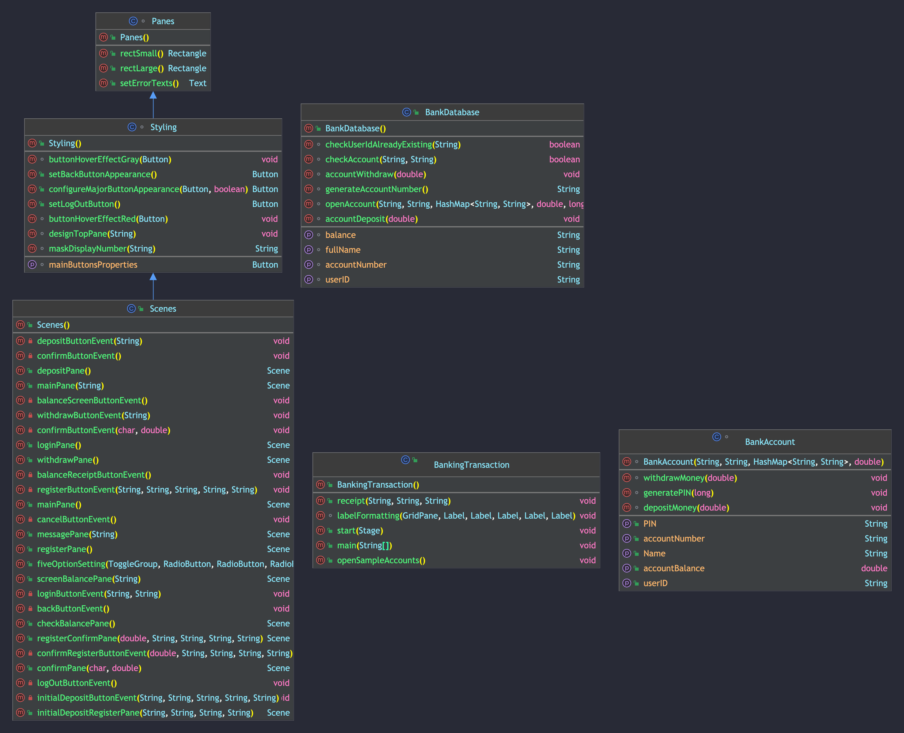

# Colgate University Banking Transaction Machine (ATM)

**Zul Ahmed**

## Overview

This JavaFX GUI program is designed for educational purposes to practice coding and is not intended for use in a real banking environment. The application allows users to register accounts, log in, deposit, withdraw, and print receipts.

## Purpose

The main objectives of this project are:

- To practice coding in JavaFX
- To familiarize with IntelliJ IDEA IDE
- To gain experience in using Apache Maven
- To apply design principles learned in class

## How to Use

1. Run the JavaFX application.
2. Choose to create a new account or log in with one of the pre-registered sample accounts.
3. Once logged in, perform various banking transactions such as deposits, withdrawals, and printing receipts.

## Sample Accounts

To test the program without creating a new account, use the following pre-registered sample accounts. All accounts share the same PIN:

- **Account Number:** 1234567891  
  **PIN**: 123456
- **Account Number:** 1234567892  
  **PIN**: 123456
- **Account Number:** 1234567893  
  **PIN:** 123456

## Layout

The GUI consists of the following panes:

1. LOGIN Pane
2. HOME Pane
3. WITHDRAW Pane
4. DEPOSIT Pane
5. CHECK BALANCE Pane (Two sub-panes)
   - First: Allows users to choose how to display the account balance
   - Second: Displays account balance on the screen
6. CONFIRM Pane
7. REGISTER Pane
8. RECEIPT Pane

## Notes

This project was created for educational purposes at Colgate University as part of a UI programming course. The application is not designed to handle real-world banking transactions or secure user data.

### Why Use Apache Maven + IntelliJ IDEA IDE?

- Maven is an open-source build tool developed by the Apache Group to build, publish, and deploy several projects at once for better project management.
- IntelliJ IDEA is used for managing packages and includes support for JavaFX by having built-in integration for it. The collaboration of the IDE and Maven allows JavaFX packages to:
  - Simplify Debugging
  - Facilitate Unit Testing
  - Manage Package Dependencies

## User Interface Design Principles

The design of this Banking Transaction Application is based on a set of user interface design principles to ensure a consistent, intuitive, and enjoyable experience for the users. These principles are as follows:

### 1. Clarity

The interface is designed to be simple, clean, and clear. This is achieved by using:

- Legible typography
- Adequate spacing between elements
- Clear and concise labels for buttons and input fields

### 2. Feedback

The application provides feedback to users during and after their interactions. Feedback is presented through:

- Visual cues (e.g., buttons changing appearance when clicked)
- Confirmation messages (e.g., after a successful transaction)
- Error messages (e.g., when incorrect input is provided)

### 3. Consistency

The application maintains consistency throughout its various panes to create a seamless user experience. Consistency is achieved by:

- Using a uniform color scheme based on Colgate University's design portfolio
- Keeping similar UI elements in the same locations across panes
- Maintaining consistent button styles and labels

### 4. Flexibility

The application is designed to be flexible and adaptable to different user needs and preferences. Users can:

- Choose to display their account balance in various formats (e.g., with or without currency symbols)

### 5. Error Prevention and Recovery

The application is designed to minimize user errors and facilitate recovery when errors do occur. This is achieved by:

- Implementing input validation to ensure that only appropriate data is entered (e.g., numeric values for account numbers and PINs)
- Providing clear error messages that guide users on how to correct their input
- Offering a "Confirm" pane to allow users to review their actions before finalizing transactions, reducing the risk of accidental errors
- Allowing users to easily navigate back to previous panes to correct mistakes

### 6. Efficiency

The application is designed to streamline the user experience, enabling users to perform banking transactions with minimal steps and effort. Efficiency is achieved through:

- Logical organization of UI elements and panes
- Providing shortcuts for common actions (e.g., quick access to deposit, withdraw, and check balance functions from the home pane)
- Ensuring snappy and quick transitions between panes

### 7. Aesthetic and Minimalist Design

The application adheres to an aesthetic and minimalist design philosophy by:

- Using a visually appealing color scheme based on Colgate University's design portfolio
- Eliminating unnecessary UI elements and clutter, focusing on essential features and functionality
- Balancing aesthetics with functionality to create an enjoyable and efficient user experience

## Program Flow Diagram

A visual representation of the program flow for classes can be found in the diagram below. This diagram illustrates the relationship between different classes and how they interact within the application.

## License

This project is licensed under the MIT License. This means you are free to use, copy, modify, merge, publish, distribute, sublicense, and/or sell copies of the software, provided that the original copyright notice and permission notice are included in all copies or substantial portions of the software.

For more information, please visit the [MIT License webpage](https://opensource.org/licenses/MIT).

## Acknowledgements

- **Colgate University**, for providing the resources and environment necessary for the project's success.
- Our course instructor, Professor Fourquet, for their guidance, encouragement, and expertise throughout the development process.
- Classmates, for their collaboration, insights, and commitment to the project.
- The **JavaFX community**, for their comprehensive documentation, tutorials, and resources that helped us learn and implement the framework.

I acknowledge that this project would not have been possible without the collective efforts and support from all those mentioned above.

#### Resources:

 This list was used to aid in the development of this application

- [JavaFX Documentation](https://openjfx.io/javadoc/11/)
- [JavaFX Tutorials](https://openjfx.io/openjfx-docs/)
- [JavaFX Community](https://openjfx.io/community/)
- [JavaFX Maven Plugin](https://github.com/openjfx/javafx-maven-plugin)
- [JavaFX Maven Example](https://openjfx.io/openjfx-docs/maven)
- [JavaFX Maven Tutorial](https://www.youtube.com/watch?v=QX4ZQZ1J8YI)
- [JavaFX IntelliJ + Maven Video Tutorial](https://www.youtube.com/watch?v=3eE-xz-l2mY&t=94s)
- [JavaFX IntelliJ + Maven Tutorial 2 (JDK 19)](https://www.youtube.com/watch?v=IvsvjUq38Jc)
- [Colgate University Brand Portfolio](https://www.youtube.com/watch?v=3eE-xz-l2mY&t=94s)

